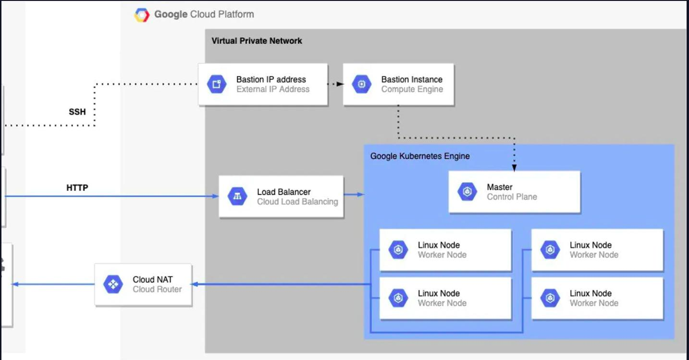

# Building Infrastructure as Code on GCP - Staging

## Preview

- You can preview the final result here: http://34.111.245.79/

## Architecture




## Steps

- Containerizing a simple python application: hello.py
- Provisioning the infrastructure on GCP using an IaC tool: Terraform.
- Deploying the application on Kubernetes.


## Building Image with Docker

To build an image of this app, please run the following command:


```bash
$ docker build -t hello_app:1.0 Demo-App/.
```

## Provisioning Infrastructure with Terraform

- You need to have an account and a project on GCP
- Pass values for the variables defined in a file with the .tfvars extension as such:

```
project_id = "PROJECT_ID"
region     = "us-central1"
vpc_name   = "final-task-net"
ip_cidr_range_mngmnt = "10.2.1.0/24"
ip_cidr_range_restricted = "10.2.2.0/24"
machine_type = "e2-micro"
node-count = 1
master_ipv4_cidr_block = "172.12.0.0/28"
services_ipv4_cidr_block = "192.168.0.0/16"
pods_ipv4_cidr_block = "172.17.0.0/16"
```
1- First, to initialize the backend, provider and modules, run the following command:

```bash
$ terraform init
```
2- You may, if you wish, create a separate workspace for each environment in your project as follows:

```bash
$ terraform workspace new dev
```

3- Before running the terraform files, make sure to create a service account with the necessary permissions to provide terraform with the Google Application Default Credentials:

```bash
$ gcloud iam service-accounts create NAME
```

```bash
$ gcloud projects add-iam-policy-binding PROJECT_ID --member="serviceAccount:NAME@PROJECT_ID.iam.gserviceaccount.com" --role=ROLE
```

4- Generate the key file for the service account

```bash
$ gcloud iam service-accounts keys create FILE_NAME.json --iam-account=NAME@PROJECT_ID.iam.gserviceaccount.com
```

5- Provide authentication credentials to your application code by setting the environment variable GOOGLE_APPLICATION_CREDENTIALS

```bash
$ export GOOGLE_APPLICATION_CREDENTIALS="KEY_PATH"
```

Note: If you want the variable to apply to future shell sessions, set the variable in your shell startup file, for example in the ~/.bashrc or ~/.profile file.

```bash
$ echo 'export GOOGLE_APPLICATION_CREDENTIALS=="KEY_PATH"' >> ~/.bashrc
```

6- To upload the image you built earlier to GCR, do as follows:
```bash
$ docker tag IMAGE-NAME:latest gcr.io/PROJECT-ID/TAG

$ docker push gcr.io/PROJECT-ID/TAG
```

7- Pull the redis image from Docker Hub and push it to gcr so that the private cluster can pull it:

```bash
$ docker pull redis

$ docker tag redis:latest gcr.io/PROJECT-ID/TAG

$ docker push gcr.io/PROJECT-ID/TAG
```


## Deploying and Accessing Application with Kubernetes

### Configuring the management instance:

1- To deploy the application, you need to access the VM in the management subnet

```bash
$ gcloud compute ssh --zone "REGION" "INSTANCE-NAME" --project "PROJECT-ID
```
2- Then generate the key of the service-account with the necessary permissions:

```bash
$ gcloud iam service-accounts keys create default_key.json --iam-account=EMAIL_OF_SERVICE_ACCOUNT
```

3- Then copy that key to the VM to activate the service account to be able to access the GKE cluster:

```bash
$ gcloud compute scp LOCAL_FILE_PATH VM_NAME:~

$ gcloud compute ssh --zone "REGION" "INSTANCE-NAME" --project "PROJECT-ID"

$ gcloud auth activate-service-account EMAIL_OF_SERVICE_ACCOUNT --key-file=default_key.json
```

### Deploying the Application

- First, install the kubectl utility in the VM instance
```bash
$ sudo yum install kubectl 
```

- Then, configure the cluster
```bash
$ gcloud container clusters get-credentials CLUSTER_NAME --region REGION --project PROJECT_ID
```

- Then, copy the yaml files to the VM
```bash
$ gcloud compute scp --recurse  PATH_TO_THE_YAML_FILES_DIR/ VM_NAME:DIR_NAME
```

- Finally, run the yaml files
```bash
$ kubectl apply -f FILE.yaml
```

## Tools
<p align="center">
<a href="https://www.python.org" target="_blank" rel="noreferrer">  </a>
<a href="https://cloud.google.com" target="_blank" rel="noreferrer">  </a>
<a href="https://www.terraform.io/" target="_blank" rel="noreferrer">  </a>  <a href="https://kubernetes.io" target="_blank" rel="noreferrer">  </a> 
</p>

